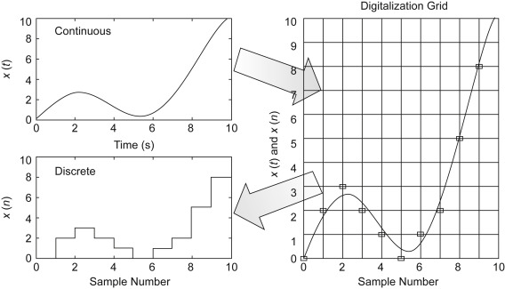

# 01. Why Everything Is A List Of Numbers!?

Look around you for a moment. Almost everything you've interacted with can be placed into one of four broad kinds of data: **numbers, images, audio,** and **text.** At first glance, these look completely different. A photograph of a mountain does not resemble a paragraph of text. A piece of music does not look like a spreadsheet. And yet, inside a computer, all of them are treated in exactly the same way. But, **why?**

A computer does not understand images, sounds, or words. It does not understand meaning. It does not even understand numbers in the way humans do. At its core, a computer is a very fast calculator. It takes numbers as input, performs operations on them, and produces numbers as output. So if a computer is to store, analyze, or reason about images, audio, or text, each of these must first be converted into numbers. Everything must become a collection of numbers. This idea is so important that we will return to it again and again.

## 1.1 - Four Kinds Of Data

To make decisions, compare things, or optimize outcomes, we first need to represent the world using numbers.

### 1.1.1 - Numbers

Numbers are the most natural kind of data. They require no translation. When you measure temperature, count people, record prices, or track time, you are already working in the language that computers understand best. Let us start with a simple decision-making problem.

**Cities as Numbers**

Suppose you want to decide which city in the world would be a good place to live for a comfortable and healthy life. You could argue endlessly about culture, food, or history, but let us begin with something concrete. Assume your first filter is weather and environment. You decide to look at three quantities: **Average temperature, Average humidity,** and **Air quality index**. Each city can now be described using three numbers. For example, City A is $(30^{\circ} \text{C}, 55\%, 110)$.

Without realizing it, you have done something powerful. You have mapped each city to a point in three-dimensional space. Every city in the world is now just a point with three coordinates. Once this representation is in place, decision-making becomes simpler. You can define acceptable ranges for each quantity: temperature between two values, humidity below a certain level, and air quality better than a chosen threshold. Any city whose point lies outside these ranges can be discarded immediately. 

You have not chosen the best city yet, but you have reduced a complex real-world problem into a manageable mathematical one. The key idea is not the specific numbers. The key idea is that representing an object as a collection of numbers allows us to filter, compare, and analyze it systematically. Let's take a more complicated example.

**Portfolios as Numbers**

Imagine you manage several investment portfolios. Each portfolio contains a different set of stocks. For each stock, you collect its price data over the last 20 days. At first, this looks messy. Different portfolios contain different numbers of stocks. Each stock produces a time series of prices. The raw data is large and difficult to compare directly. So, we will make our lives easy with some number crunching!

For each portfolio, you can compute its total value for each of the last 20 days by adding the values of all stocks it contains. This gives you a sequence of 20 numbers per portfolio. From these 20 numbers, you now define two quantities: 

* **Reward**: today’s value minus the value on day one
* **Risk**: the standard deviation of the 20 values

Every portfolio, no matter how complex, has now been reduced to an ordered pair: $\text{(reward, risk)}$. This is a remarkable simplification. Hundreds or thousands of raw numbers are distilled into just two. If you plot these pairs on a two-dimensional plane, each portfolio becomes a point. 

<figure markdown="span">
    {width=60%, }
    {width=60%, }
</figure>

!!! note "Markowitz's Efficient Portfolio Theory"

    The most interesting points lie along what is called **the efficient frontier.** These portfolios are optimal in the sense that: **for a given level of risk, no other portfolio offers higher reward; and for a given level of reward, no other portfolio carries lower risk.** 

    For example, $P1$ is optimal for an investor who wants the lowest possible risk, even though the reward is modest. Moving to $P2$ or $P3$ increases risk, but also increases reward in the best possible way. In contrast, a point like $P6$ is never a good choice, since there exists a point on the frontier with either higher reward at the same risk or lower risk for the same reward. The efficient frontier thus consists precisely of those points, like $P1$ and $P2$, that **cannot be improved in upon returns without making a risk tradeoff.** 

    This idea is a central result of **Modern Portfolio Theory**, developed by Harry Markowitz. For this contribution, he was awarded the Nobel Prize in Economics in 1990.

### 1.1.2 - Images

When you buy a phone, one of the camera specifications you often see is **megapixels**. A 100-megapixel camera means that a single photo contains roughly $100 \times 10^6$ pixels. **A pixel is the smallest unit of an image.** It is just a tiny square of color.

Each pixel is not a single number. It is usually described by **three numbers**: R for red, G for green, and B for blue. Each of these numbers tells you how much of that color is present in the pixel. By mixing red, green, and blue in different amounts, we can produce almost any visible color. So one pixel is really an ordered triple: **(R, G, B).**

<figure markdown="span">
    {width=60%, }
</figure>

Now imagine a very small image made of 9 pixels, arranged in **$3 \times 3$ grid**. Each pixel has three values. So this image is a **$3 \times 3 \times 3 = 27$ collection of numbers**.

$$
\begin{bmatrix}
(R_{11}, G_{11}, B_{11}) & (R_{12}, G_{12}, B_{12}) & (R_{13}, G_{13}, B_{13}) \\
(R_{21}, G_{21}, B_{21}) & (R_{22}, G_{22}, B_{22}) & (R_{23}, G_{23}, B_{23}) \\
(R_{31}, G_{31}, B_{31}) & (R_{32}, G_{32}, B_{32}) & (R_{33}, G_{33}, B_{33})
\end{bmatrix}
$$

If we now flatten this image by reading pixels row by row and listing their color values, we obtain a single sequence of numbers. 

$$
\begin{array}{l}
[\,R_{11}, G_{11}, B_{11}, R_{12}, G_{12}, B_{12}, R_{13}, G_{13}, B_{13}, \\ 
 \quad R_{21}, G_{21}, B_{21}, R_{22}, G_{22}, B_{22}, R_{23}, G_{23}, B_{23}, \\
 \quad R_{31}, G_{31}, B_{31}, R_{32}, G_{32}, B_{32}, R_{33}, G_{33}, B_{33}\,]
\end{array}
$$

These 27 numbers are a complete numerical representation of that image. This is the key idea. An image is not a picture to a computer. It is just a sequence of numbers arranged in a particular order.

In real life, images are far larger than $3 \times 3$. A high-resolution photo may contain millions of pixels, which means millions of triples like (R, G, B). That is a huge amount of data. Storing and transmitting all those numbers directly would be inefficient. This is why formats like PNG and JPEG exist. They do not change the basic idea that an image is made of numbers. Instead, they store those numbers in much smarter ways, exploiting patterns and redundancies so that fewer numbers are needed to represent almost the same image. Some information may be preserved exactly, and some may be approximated, depending on the format.

We will not go into the details of how this compression works. What matters here is the principle. Even when images are compressed, the crux remains unchanged. An image is ultimately represented as a structured collection of numbers. 

### 1.1.3 - Audio

Audio feels very different from images. We hear sound as something continuous. But just like images, audio must also be turned into numbers before a computer can store or process it. **Sound is a vibration.** When someone speaks or a guitar string vibrates, it creates changes in air pressure over time, denoted as $x(t)$ in the following diagram. An audio recording is simply a record of how this pressure changes.

<figure markdown="span">
    {}
</figure>

A computer cannot store a continuous curve. Instead, it **samples** the wave at regular time intervals. Each measurement is called a **sample**. The **sampling rate** tells us how many samples are taken per second. **44,100 samples per second is a common rate used in music** (double the human ear's listening frequency range). This means the waveform is measured 44,100 times every second. 
Each of these measurements is just a number representing the height of the wave at that moment. So after sampling, a one-second audio clip is no longer a smooth curve. It is a long list of numbers: $[x_1, x_2, x_3, \dots, x_{44100}]$. These numbers still represent the same sound, but now in a form a computer can work with.

There is one more step performed in reality. The wave height is not stored as an arbitrary real number. A computer restricts it to a fixed set of allowed values. This process is called **quantization**. The number of allowed values depends on the **bit depth**. 8-bit audio allows 256 possible values, 16-bit audio allows 65,536 possible values and 24-bit audio allows even more. Quantization replaces the exact wave height with the nearest allowed level. This introduces a small error, but if the resolution is high enough, the error is imperceptible to human ears. So each sample becomes a single integer chosen from a fixed range.

After sampling and quantization, audio is nothing more than a sequence of numbers ordered in time. For example, a short audio clip might be represented as $[\,x_1, x_2, x_3, x_4, \dots, x_N\,]$. Here, each $x_i$ is a quantized sample of the sound wave at a specific instant. For stereo audio, there are two such sequences, one for the left ear and one for the right.

For longer recordings, the sequence simply becomes longer. Just like images, raw audio contains a huge number of values. This is why formats like WAV, MP3, and AAC exist. They store the same numerical information more efficiently by exploiting patterns in sound and limitations of human hearing. The exact details differ, but the foundation does not change.

### 1.1.4 - Text

Text is the most subtle of the four data types, because its structure is not physical. Images live on a grid. Audio lives on a timeline. Text lives in meaning and context. This means even though we know today how to represent text as sequence of numbers, it is not trivial at all. 

State-of-the-art text systems do not treat text as isolated characters or even isolated words. Instead, they start from a simple observation: words derive meaning from how they are used. If two words tend to appear in similar contexts, they are likely to have related meanings. Modern models learn this structure directly from large collections of text. Each word, or more precisely each *token*, is mapped to a point in a high-dimensional numerical space. This mapping is learned, not hand-designed. The coordinates themselves have no direct human interpretation, but their geometry matters. **Words with similar meanings lie close together. Words used in similar grammatical roles form clusters.**

A sentence is then represented not as a single number, but as a structured collection of these points, arranged in the order the tokens appear. Larger pieces of text are built by combining and transforming these numerical representations. Under the hood, everything is still numbers. Very large collections of them. What has changed is the sophistication of the mapping from language to numbers. 

We will not study how these representations are learned or optimized here. That belongs to deep learning and natural language processing.

## 1.2 - Vectors and Matrices

So far, we have been talking about collections of numbers. At this point, we should stop calling it as some arbitrary collection, or pair, or triplets or a sequence. It's too clumsy for something so universal, and hence we need a name of it. This structure is called **a vector.** 

!!! quote "Definition: Vector"

    A **vector** is simply an ordered collection of numbers written vertically. If a quantity has three components, we write it as 

    $$
    \begin{bmatrix}
    x_1 \\
    x_2 \\
    x_3
    \end{bmatrix}
    $$

    This vertical arrangement is not a stylistic choice. It reflects how we think about the components as belonging together, forming a single object.

    This term was coined by Irish mathematician and astronomer, Sir William Rowan Hamilton, in 1846 when he was trying to understand how distances between planets and moons vary. 

Now suppose we do not have just one such object, but many. Naturally, we place these vectors side by side and obtain a **matrix**.

!!! quote "Definition: Matrix"

    A **matrix** is simply a **collection of vectors** written next to each other. 

    $$
    \begin{bmatrix}
    a_1 & a_2 & a_3 \\
    b_1 & b_2 & b_3 \\
    c_1 & c_2 & c_3
    \end{bmatrix}
    $$

    Each **column** is a vector. Each **row** collects the same component across different vectors. This way of organizing information is extremely powerful. It allows us to look at many objects at once while keeping their structure intact.

Recall that each city was represented by three numbers: average temperature, average humidity, and air quality index. Suppose we collect this data for five cities. Each city gives us one vector with three components. Placing these five vectors side by side produces the following matrix.

$$
\begin{bmatrix}
\text{Temp}_1 & \text{Temp}_2 & \text{Temp}_3 & \text{Temp}_4 & \text{Temp}_5 \\
\text{Hum}_1  & \text{Hum}_2  & \text{Hum}_3  & \text{Hum}_4  & \text{Hum}_5 \\
\text{AQI}_1  & \text{AQI}_2  & \text{AQI}_3  & \text{AQI}_4  & \text{AQI}_5
\end{bmatrix}
$$

Each **column** represents one city. Each **row** represents one attribute. 
The first row compares temperatures across cities.
The second row compares humidity levels.
The third row compares air quality.

## 1.3 - First Vector Operation

Up to now, a vector has been a column of numbers. That is the algebraic view. Let us now connect it to geometry.

Take a two-dimensional vector written vertically as

$$
\begin{bmatrix}
a \\
b
\end{bmatrix}
$$

Place a coordinate system on the plane. The first component measures movement along the horizontal axis, the second along the vertical axis. In other words, start at the origin. Walk $a$ units along the x-axis. Then walk $b$ units along the y-axis. Where you stop is the tip of an arrow. That arrow is the vector. This idea is captured by writing the vector as a combination of **unit vectors**. 

$$
\mathbf{v} = a\hat{i} + b\hat{j}
$$

Here, $\hat{i}$ is the unit vector pointing one step along the x-axis, and $\hat{j}$ is the unit vector pointing one step along the y-axis. Multiplying by $a$ or $b$ simply means taking that many steps in the corresponding direction.

<figure markdown="span">
    {width=50%, }
    {width=50%, }
</figure>

The same idea extends naturally to three dimensions. A vector with three components,

$$
\begin{bmatrix}
a \\
b \\
c
\end{bmatrix}
$$

can be written as

$$
\mathbf{v} = a\hat{i} + b\hat{j} + c\hat{k}
$$

where $\hat{k}$ is the unit vector along the third axis. You can think of this as walking $a$ steps east, $b$ steps north, and $c$ steps upward. The final position depends only on the total movement, not on the path taken. This is an important idea. **A vector represents displacement, not location.** It describes how far and in what direction you moved w.r.t. your starting point. So, the starting point of the vector doesn't matter. 

### Vector Addition

The first operation we define on vectors is **addition**. Suppose we have two vectors in the plane,

$$
\mathbf{u} =
\begin{bmatrix}
1 \\
2
\end{bmatrix},
\qquad
\mathbf{v} =
\begin{bmatrix}
3 \\
1
\end{bmatrix}
$$

Algebraically, vector addition is simple. We add corresponding components. 

$$
\mathbf{u} + \mathbf{v} =
\begin{bmatrix}
1 + 3 \\
2 + 1
\end{bmatrix}
= 
\begin{bmatrix}
4 \\
3
\end{bmatrix}
$$

Geometrically, this operation can be understood in any of the two equivalent ways. 

**Triangle law**

Draw the vector $\mathbf{u}$ as an arrow starting at the origin. Now place the tail of $\mathbf{v}$ at the tip of $\mathbf{u}$. The arrow from the origin to the tip of $\mathbf{v}$ represents $\mathbf{u} + \mathbf{v}$. This is called the **triangle law of vector addition**. You walk along the first vector, then along the second. The direct path from start to finish is their sum.

<figure markdown="span">
    {width=50%, }
    {width=50%, }
</figure>

**Parallelogram law**

Place both vectors $\mathbf{u}$ and $\mathbf{v}$ so that they start at the origin. Complete the parallelogram formed by these two arrows. The diagonal of the parallelogram, starting from the origin, is again the vector $\mathbf{u} + \mathbf{v}$. This is the **parallelogram law of vector addition**.

<figure markdown="span">
    {width=50%, }
    {width=50%, }
</figure>

Both laws describe the same operation. 

---
