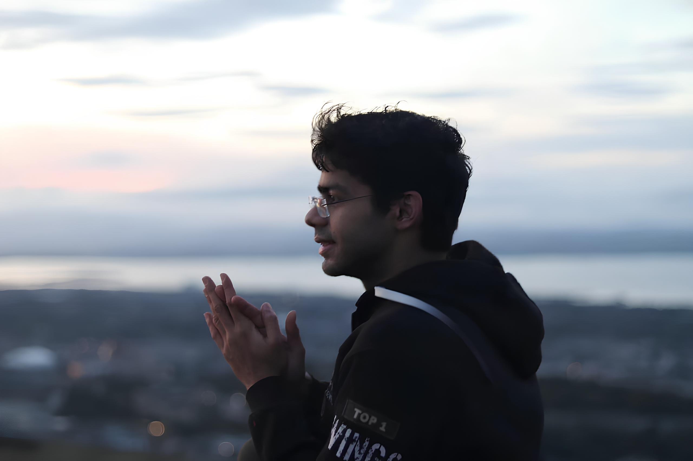
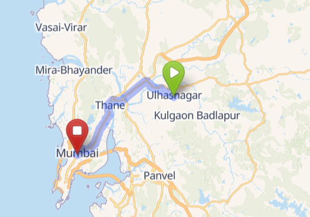
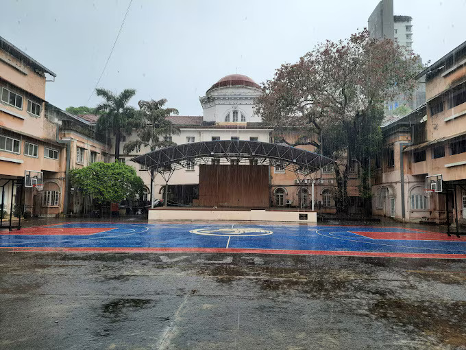
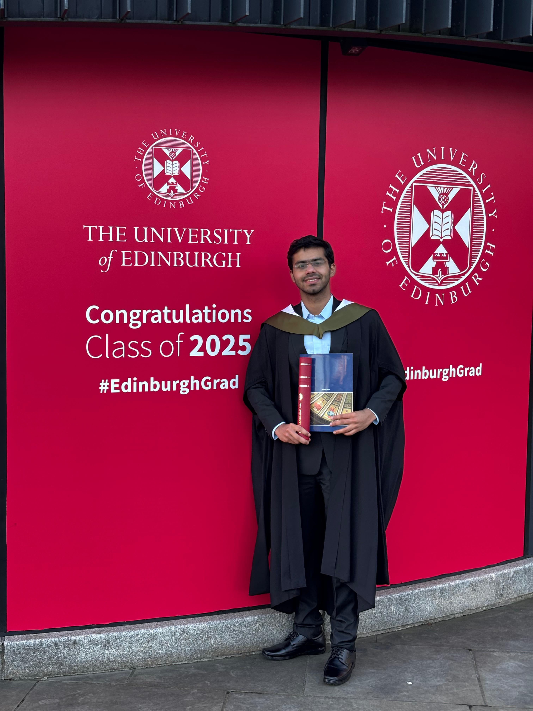

# Hi, I'm Sagar Udasi. 👋

  {width="95%"}

I work in **Artificial Intelligence and Machine Learning** space, building systems grounded in mathematics, statistics, machine learning, and software engineering. I care less about models in isolation and more about building something that holds up when put in the real world.

I entered this space by accident **in 2019**, after overhearing two researchers argue about an NLP problem at **Samsung.** From there, curiosity carried me forward. That detour took me from applied research on Alexa’s NLU systems at **Amazon** to consulting roles where I built AI systems for companies like **Puma** and **AB InBev**. 

For the past four years, I have been working with **the startups in the education space**. I certainly believe that education has not kept up with the technological progress and there is a serious need for an update. 

---

## It all began on August 05, 1999...

I grew up in a small town near Mumbai, called **Ulhasnagar**. 

During my childhood, I took the saying **"all work and no play makes jack a dull boy"**, a bit too literally. I was probably the most mischievous kid in my school. So much so that I used to get reliably suspended at least once every year! 🙂

But still somehow, I remained good at studies. The paradox peaked in 2015, when the same student who spent years in trouble **finished first in the Mumbai division with 95.60%.**

I wanted to become a doctor, but one of my teachers convinced me to pursue engineering. It was a leap of faith, one I don’t regret today.

  {width="90%"}

## ...then VJTI happened.

  {width="92%"}

On August 02, 2017, I joined **Veermata Jijabai Technological Institute (VJTI)** to study **Electronics and Communication Engineering (ECE)**. 

In India, the branch often matters less than where you eventually end up, and most roads quietly lead to software. So I studied electronics during the day and spent the rest of my time teaching myself things I suspected would matter later: **robotics, computer science, software development, blockchain, ML, AI,** and whatever else caught my attention. 

Somewhere along the way, the movie **3 Idiots** nudged me toward building things instead of just being good at exams. I didn’t have a clear plan, only **curiosity**, and in retrospect, that turned out to be the one trait that carried me through engineering. 

After my degree, I mapped each semester in a flowchart to see what I was taught, what I taught myself, what subjects I actually liked, and the ones I hated. I’m not sure why I did it; it just felt worth doing. Here's how **my learning journey during my engineering days** looked like. Subjects stacked on the left didn't directly help me in my career. 

{width="91%"}

## It was time to gain some experience...

| Org               | Designation                                                           | What I Worked On                                                                                                                                                                                                | Tenure              |
| :------------------: | :---------------------------------------------------------------------: | --------------------------------------------------------------------------------------------------------------------------------------------------------------------------------------------------------------- | :-------------------: |
| {width="360"}       | **Research Intern: Voice Intelligence**     | Worked on semantic similarity for Bixby, improving how the assistant reasoned about meaning between sentences.                                                                                                  | May 2020 – Jul 2020 |
| {width="140"}       | **Applied Scientist I**                 | Analyzed failure patterns in Alexa Music queries and improved recommendation features; contributed to research on memorization in deep neural networks; shipped a native iOS login system used by 20m+ devices. | Aug 2021 – Jul 2022 |
| {width="300"} | **Software Development Engineer & Technical Instructor** | Built ML systems to predict student dropouts using 100+ behavioral signals; triggered automated interventions that improved retention by ~30%. Designed and launched *"Data Science Certification Program"* from scratch, with the major focus on curriculum and delivery.                                                                 | Aug 2022 – Jul 2023 |
| {width="140"}      | **Associate Director: Data Science**     | Designed adaptive learning systems that detected conceptual gaps in real time; scaled and mentored the data team; deployed production models into live classrooms.                                              | Jul 2023 – Mar 2024 |
| {width="160"}      | **Senior AI Engineer**                        | Built agentic AI systems using the Llama ecosystem; reduced AI infra costs by ~40%; developed RAG-based analytics and generative policy-reasoning systems for **Puma** client.                                | May 2024 – Apr 2025 |

## ...and then higher education in Edinburgh!

When I left college, I had a quiet sense that I’d only just begun learning. Many of the subjects that interested me most: machine learning or artificial intelligence, came late in the curriculum; the early years were mostly spent building foundations. That feeling sharpened once I started working. I was surrounded by people who were clearly sharper, deeper, and more fluent in their domains, and it made the gap obvious. I wanted time to close it. 

So I stepped away for a year and enrolled in the **Statistics with Data Science** program at the **University of Edinburgh**. Statistics felt like the right core: both because of the university’s strength in the field and its lineage, going back to **Thomas Bayes**. I took a lot of **Finance** courses to gain the domain specialization!

| Term 1 | Term 2 | 
| :---: | :---: | 
| Bayesian Theory | Bayesian Data Analysis | 
| Statistical Programming | Mathematical Simulations | 
| Generalised Regression Models  | Design & Sampling for Data Science | 
| Credit Scoring | Optimization Methods in Finance | 
| Discrete Time Finance | Statistical Research Skills | 
| Finance, Risk, & Uncertainty | Dissertation |

  {width="95%"}

## And now, back in India, back to work!

  {width="90%"}

I am now working with **Tetr College of Business** building the AI program while helping students and teams build real businesses. It sits at the intersection of everything I care about: education, startups, business, and AI. 

It feels like the kind of work I’d been unconsciously preparing for over a long time. For now, this is where the threads come together!

---

**Finally, I welcome you to my digital space. Feel free to explore!**

